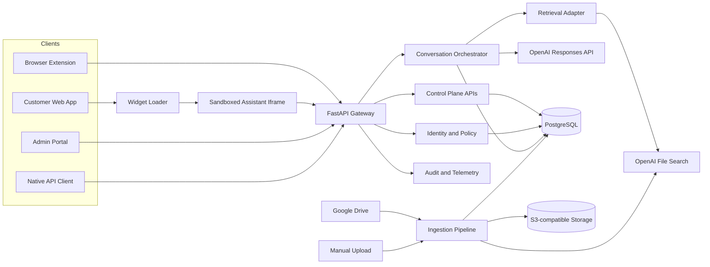
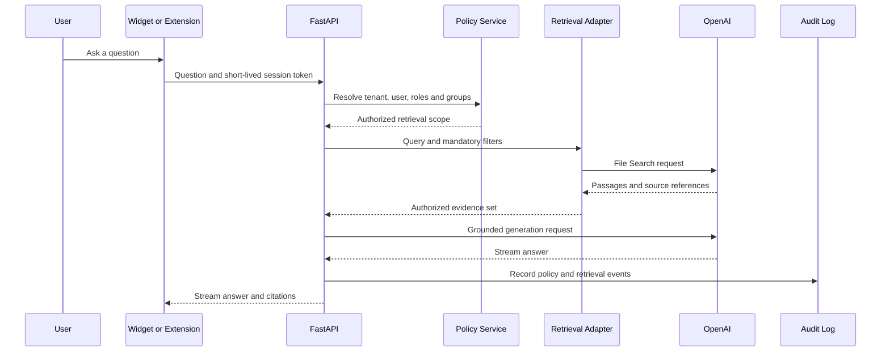

# Architecture

## Decision

Use managed OpenAI File Search for the initial retrieval implementation, isolated per tenant or high-level security boundary, behind a provider-neutral retrieval adapter. Keep canonical documents in S3-compatible storage and control-plane records in PostgreSQL.

## Primary components

- **Widget loader:** framework-independent TypeScript bundle that creates a Web Component launcher and sandboxed iframe.
- **Assistant web:** Next.js chat application served from a dedicated assistant origin.
- **Administration web:** Next.js portal for sources, documents, ingestion status, usage, feedback, audit events, settings, and evaluations.
- **Browser extension:** Chrome Manifest V3 side-panel experience using the same assistant API.
- **FastAPI service:** authentication, tenant resolution, authorization, short-lived sessions, conversation orchestration, retrieval, citations, administration APIs, audit events, and telemetry.
- **Ingestion worker:** validates, scans, extracts, normalizes, versions, uploads, indexes, reconciles, and deletes documents.
- **PostgreSQL:** tenants, users, roles, groups, sources, documents, versions, jobs, conversations, feedback, prompt metadata, and audit events.
- **Object storage:** canonical document copies and controlled lifecycle.
- **Managed queue:** asynchronous ingestion work.
- **OpenAI Responses API and File Search:** generation and initial hosted retrieval.
- **OpenTelemetry:** traces, metrics, and structured-log correlation.

## Context diagram

## Query authorization sequence

## Security invariants

1. Tenant identity comes only from validated authentication and policy context.
2. The model never selects authorization filters.
3. Retrieval uses the tenant's configured vector store and mandatory metadata filters.
4. PostgreSQL Row-Level Security protects every tenant-owned table.
5. Object-storage paths, queue messages, caches, traces, and audit events remain tenant scoped.
6. Browser clients contain no provider or infrastructure secrets.
7. Retrieved documents are untrusted input and cannot override system instructions.
8. Deletion propagates to hosted indexes, object storage, metadata, and caches according to retention policy.

## Replaceability boundary

Application orchestration depends on internal retrieval request and result contracts. OpenAI SDK objects must not escape the File Search adapter. Future pgvector or OpenSearch adapters can implement the same interface without changing public client APIs.

## Deployment topology

Use isolated local, preview, development, staging, and production environments. Each environment has separate databases, buckets, queues, OpenAI projects and vector stores, IdP clients, secrets, telemetry namespaces, domains, and rate limits. Build artifacts once and promote immutable digests through environments.
